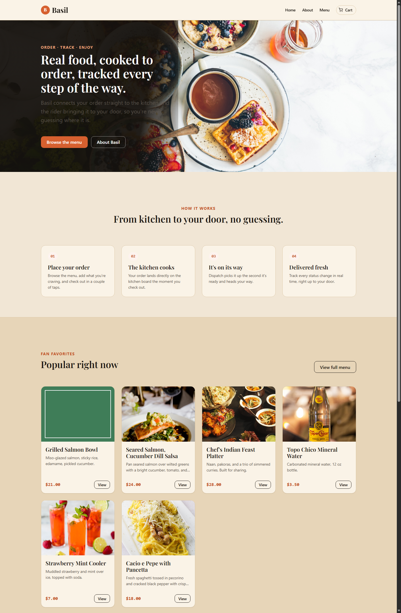
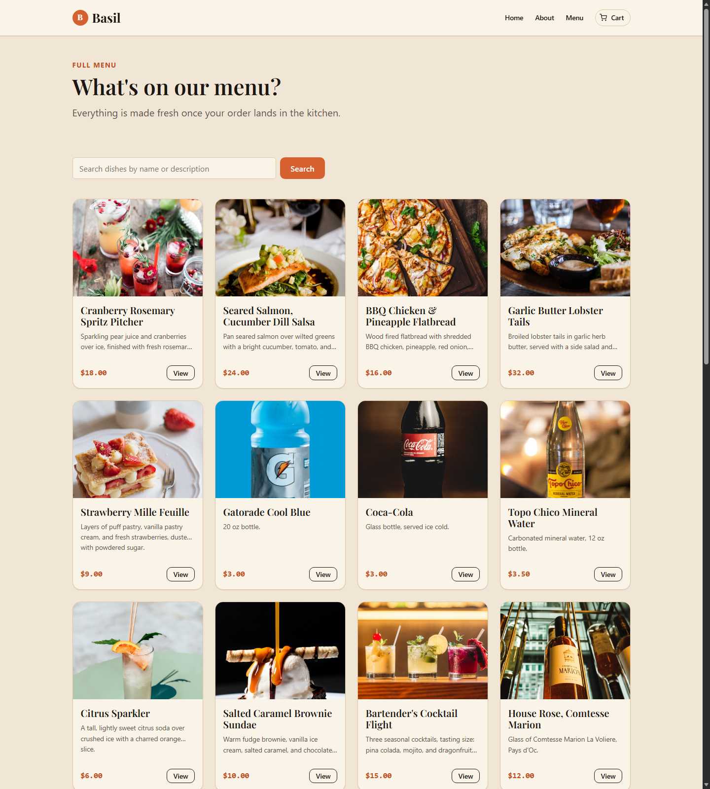
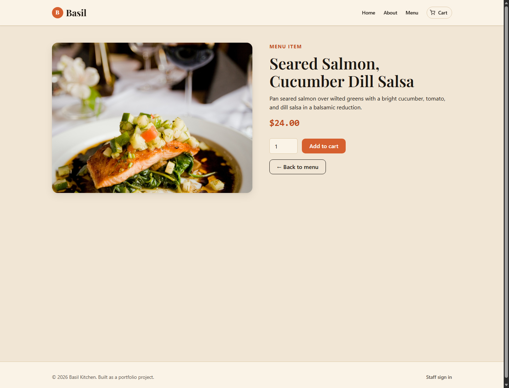
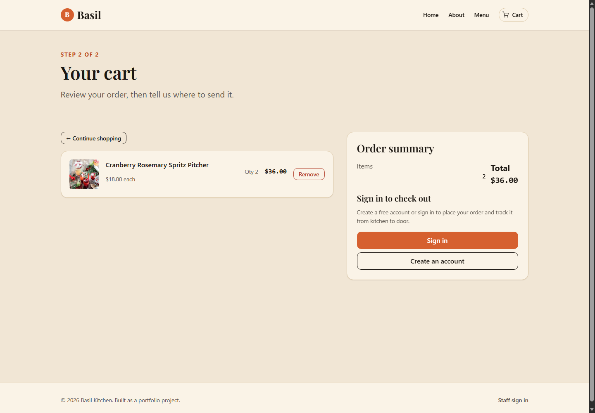
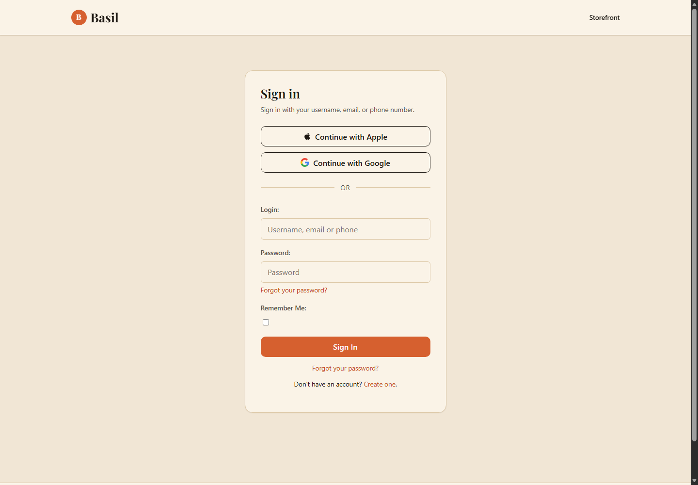
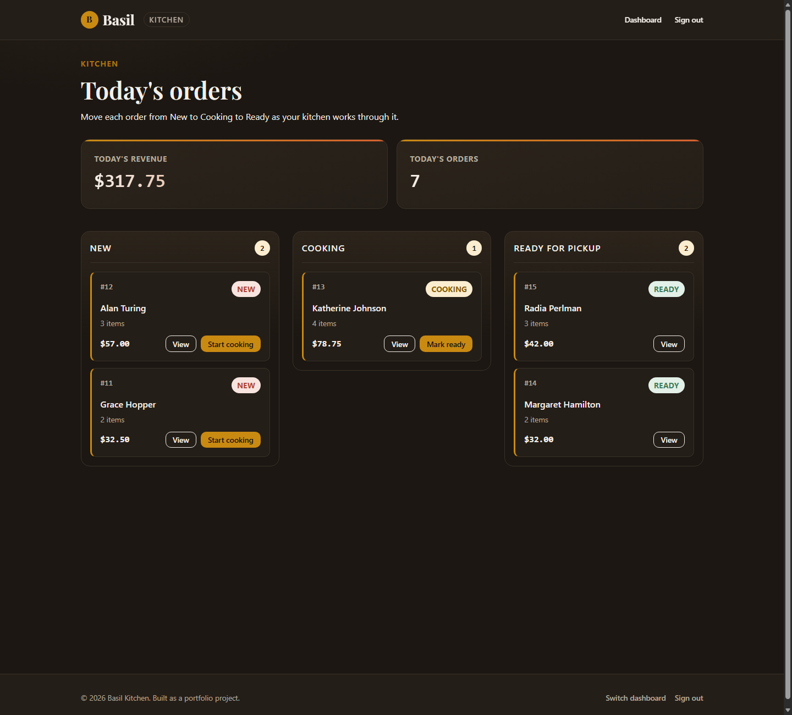
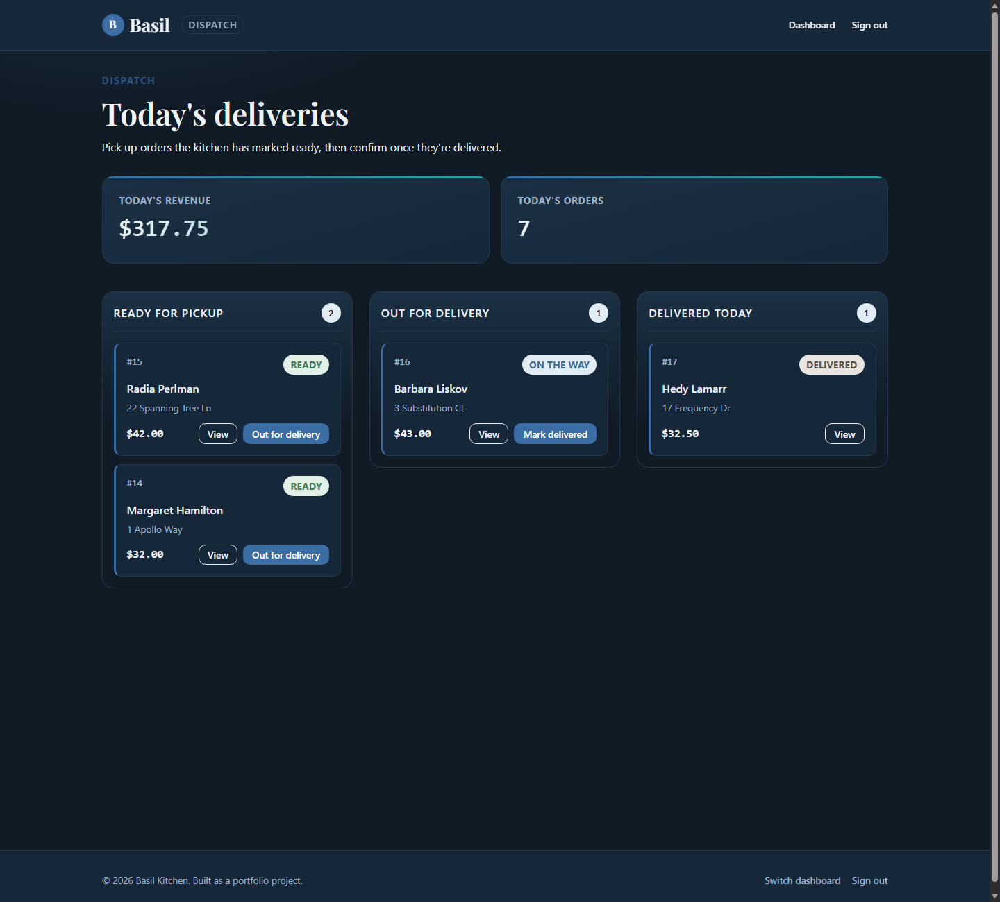
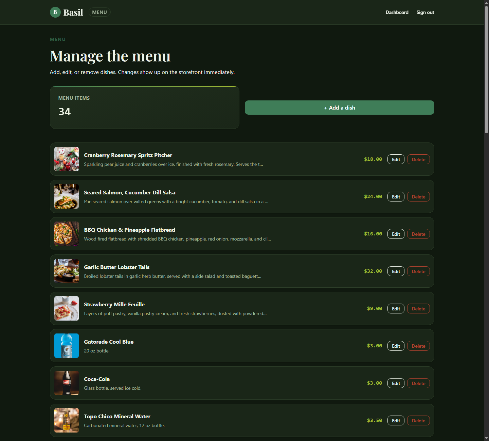

# Basil: Online Food Delivery Platform

A Django application that models a full food delivery operation as four
connected roles working off one shared order pipeline: a **customer**
storefront, a **kitchen** dashboard, a **dispatch** dashboard, and a
**menu** dashboard. An order placed by a customer appears on the kitchen
board immediately, moves through the kitchen's workflow, and hands off to
dispatch for delivery, with every status change visible in real time to
whoever needs to see it.

```
placed --> cooking --> ready --> out for delivery --> delivered
customer         kitchen            dispatch
```

## Screenshots

| Landing page | Menu |
| --- | --- |
|  |  |

| Product detail | Cart (sign in to check out) |
| --- | --- |
|  |  |

| Sign in (username, email, phone, Google, Apple) | Kitchen dashboard |
| --- | --- |
|  |  |

| Dispatch dashboard | Menu dashboard |
| --- | --- |
|  |  |

## Features

### Customer storefront
- Browse the full menu with search by dish name or description.
- Add dishes to a cart that persists for anonymous visitors via a device
  cookie, or against a signed in account. Adding an item shows a short fly
  to cart animation and updates a live count badge on the cart icon.
- Adjust quantities, remove items, and see a running order total.
- Browsing and adding to cart works without an account. Checking out
  requires signing in, the same way most online checkouts work. A
  guest's cart is carried over automatically the moment they sign in or
  create an account, nothing gets lost.
- A confirmation prompt before an order is placed, so a click can't submit
  an order by accident.
- Single page checkout that captures name, email, delivery address, and
  phone number, then submits the order straight to the kitchen.
- Order confirmation page with a full itemized summary.

### Sign in and sign up
- One account system for customers and staff, with a username, an email
  address, or a phone number, in any combination.
- Google and Apple sign in (needs your own OAuth credentials, see
  Configuration below).
- Phone number verification sends a one time code. Locally it prints to
  the console the same way outgoing email does, swap in a real SMS gateway
  for production.

### Kitchen dashboard (`/cook/dashboard/`)
- A kanban style board with three columns: **New**, **Cooking**, and
  **Ready for pickup**.
- Today's revenue and order count at a glance.
- One click to move an order from New to Cooking to Ready.
- A detail view per order with the full item list and customer contact
  information.
- Restricted to staff accounts (or anyone in the `staff` group).

### Dispatch dashboard (`/dispatch/dashboard2/`)
- The same kanban layout, picking up where the kitchen leaves off: **Ready
  for pickup**, **Out for delivery**, **Delivered today**.
- One click to move an order from Ready to Out for delivery to Delivered.
- Restricted to staff accounts (or anyone in the `dispatch` group).

### Menu dashboard (`/menu-admin/dashboard3/`)
- Add, edit, and delete dishes and drinks, photo included. Changes appear
  on the storefront right away.
- Restricted to staff accounts (or anyone in the `menu` group).

Staff who belong to more than one of these three groups get a picker after
signing in to choose which dashboard to open. Everyone else lands straight
on theirs.

All three dashboards share one status pipeline defined on the
`OrderModel`, so an order's state is always consistent no matter which
dashboard is looking at it. There is exactly one source of truth for
where an order stands.

## Tech stack

- **Backend:** Django 4.2 (LTS)
- **Auth:** django-allauth, with username, email, phone, Google, and Apple
  sign in for both customers and staff
- **Database:** SQLite by default (swap `DATABASES` in `settings.py` for
  Postgres/MySQL in production)
- **Frontend:** hand-written CSS with a small design token system (no
  Bootstrap, no Tailwind, no CDN dependency beyond a Google Fonts import
  for the display typeface) and a handful of lines of vanilla JavaScript
- **Static files / production serving:** WhiteNoise
- **WSGI server:** Gunicorn

## Local setup

```bash
# 1. Clone and enter the project
git clone https://github.com/Jenks00/Django-Online-Food-Delivery-Application.git
cd Django-Online-Food-Delivery-Application

# 2. Create and activate a virtual environment
python -m venv venv
source venv/bin/activate        # Windows: venv\Scripts\activate

# 3. Install dependencies
pip install -r requirements.txt

# 4. Configure environment variables (all optional for local dev)
cp .env.example .env

# 5. Apply migrations
python manage.py migrate

# 6. Create a staff account (used to sign in to any of the three dashboards)
python manage.py createsuperuser

# 7. (Optional) seed a demo menu and a handful of sample orders across
#    every stage of the pipeline, so the dashboards aren't empty
python manage.py seed_demo_data

# 8. Run the development server
python manage.py runserver
```

Then visit:

- `http://127.0.0.1:8000/`: customer storefront
- `http://127.0.0.1:8000/cook/dashboard/`: kitchen dashboard (staff sign in required)
- `http://127.0.0.1:8000/dispatch/dashboard2/`: dispatch dashboard (staff sign in required)
- `http://127.0.0.1:8000/menu-admin/dashboard3/`: menu dashboard (staff sign in required)
- `http://127.0.0.1:8000/admin/`: Django admin

## Configuration

All configuration lives in environment variables, read in `Food_delivery/settings.py`
with safe local development fallbacks so the project runs out of the box
without a `.env` file:

| Variable | Purpose | Local default |
| --- | --- | --- |
| `SECRET_KEY` | Django's cryptographic signing key | a development only key baked into the repo |
| `DEBUG` | Enables Django's debug mode | `True` |
| `ALLOWED_HOSTS` | Comma separated list of allowed hostnames | `localhost,127.0.0.1` |
| `GOOGLE_CLIENT_ID` / `GOOGLE_CLIENT_SECRET` | Google sign in (console.cloud.google.com) | unset, button renders but sign in fails until set |
| `APPLE_CLIENT_ID` / `APPLE_CLIENT_SECRET` / `APPLE_KEY_ID` / `APPLE_PRIVATE_KEY` | Apple sign in (developer.apple.com) | unset, button renders but sign in fails until set |

See `.env.example` for the full list.

## Deployment

The project ships with a `Procfile` for platforms that use one (Heroku
style buildpacks, Render, Railway, and similar):

```
web: gunicorn Food_delivery.wsgi --log-file -
release: python manage.py migrate --noinput
```

To deploy:

1. Set real values for `SECRET_KEY`, `DEBUG=False`, and `ALLOWED_HOSTS` in
   your platform's environment variable settings.
2. Static files are served by WhiteNoise directly from the Gunicorn
   process, no separate static file host is required. Run
   `python manage.py collectstatic` as part of your build step (most
   platforms that read a `Procfile` do this automatically).
3. Point `DATABASES` at a managed Postgres/MySQL instance for anything
   beyond a demo deployment. SQLite is fine for local development but is
   not suitable for concurrent production traffic.
4. Run the `release` command (or `python manage.py migrate` manually)
   before the first deploy.
5. Swap the console phone adapter (`customer/account_adapter.py`) for a
   real SMS gateway if you want phone verification to actually deliver
   codes.

## Project structure

```
Food_delivery/         Django project package (settings, root urls, wsgi/asgi)
customer/               Storefront: menu, cart, checkout, order model, auth adapter
cook/                    Kitchen dashboard
dispatch/                Dispatch dashboard
menuadmin/               Menu dashboard: add, edit, delete dishes
templates/               Shared base templates and django-allauth templates
static/                  Hand-written CSS/JS shared across all four roles
assets/screenshots/      Screenshots used in this README
```

## Known limitations

This is a portfolio project, not a production food delivery platform. A
few deliberate simplifications:

- Payment is cash on delivery only, there is no payment gateway
  integration.
- Phone verification codes print to the server console locally instead of
  sending a real text message.
- There is no real time push between dashboards, refreshing the page picks
  up the latest state.
